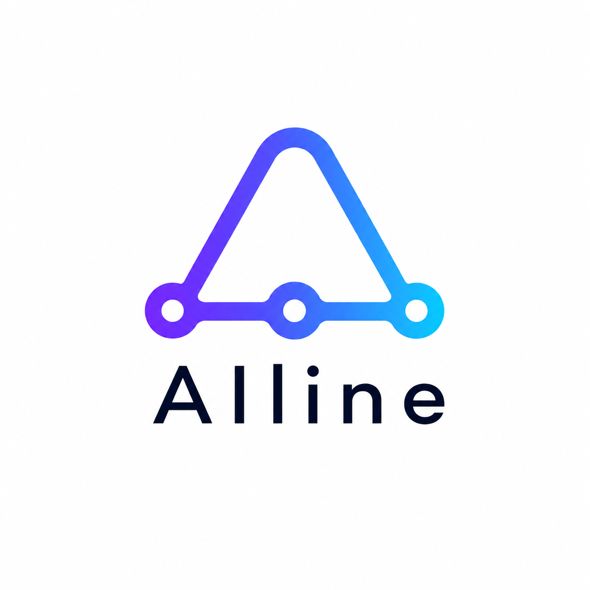

# AIline

ML experiment lineage tracker with snapshot-based reproducibility.

## Documentation

- Landing docs (this repo): [`landing-docs/ailine/index.html`](landing-docs/ailine/index.html)
- Web docs source pages: [`landing-docs/ailine/`](landing-docs/ailine/)
- Core tracking contract: [docs/track-contract.md](docs/track-contract.md)
- Reproducibility contract: [docs/repro-contract.md](docs/repro-contract.md)

AIline captures the **exact** code that produced an experiment — including
uncommitted changes — alongside DVC-managed data and MLflow run metadata, so
past experiments can be inspected and (eventually) re-run with confidence.

## Install (editable / development)

```bash
poetry install
# or, with pip
pip install -e .
```

## Quick start (your own project)

```bash
pip install ailine-core                             # or: poetry add --group dev ailine-core
cd /path/to/your/repo
ailine init-workspace                               # writes default .ailine.yml + .ailineignore
ailine doctor                                       # green-light all checks
ailine track -- python train.py --epochs 5          # run + record
ailine status --verbose                             # see what was captured
```

Releases are published to [PyPI](https://pypi.org/project/ailine-core/) when a
`v*.*.*` tag is pushed (see `.github/workflows/release.yml`).

`ailine track --` is the primary, no-magic interface. It snapshots dirty
state, records DVC linkage + environment fingerprint + the exact argv, runs
your command in the repo root, and propagates the exit code. Your training
script keeps full ownership of MLflow runs (`track.mlflow.mode: inherit`).
See [docs/track-contract.md](docs/track-contract.md) for the schema.

### Demo / tutorial flow

The legacy "clone a sample repo and pretend-train" flow is still available
behind explicit `*-demo` commands:

```bash
ailine init-demo <git_repo_url>     # clone into ./repo
ailine run --script train.py        # demo: wraps in MLflow, records snapshot
ailine reset-demo                   # remove ./repo, DB, mlruns/
```

### CLI command summary

| Command | Purpose |
|---------|---------|
| `ailine init-workspace [--force]` | Bootstrap the pip-install workflow: write a default `.ailine.yml` and ensure state directories. No clone. |
| `ailine doctor [--json] [--strict] [--config PATH]` | Validate `.ailine.yml` and the local environment. The single source of truth for "is my setup OK". |
| `ailine track [--config PATH] [--run-name NAME] [--name NAME] -- <argv...>` | Run a command under AIline tracking. The argv after `--` is executed verbatim from the repo root. The lineage row is published with `status=in_progress` *before* the child starts (and the MLflow run id, in `wrap` mode, is printed alongside) so live runs are visible in `ailine status` and the web UI from second zero. Snapshot location is configured via `snapshot.storage_dir` in `.ailine.yml` (or `AILINE_STORAGE_DIR`). |
| `ailine restore <snapshot_id> [--config PATH] [--dry-run] [--force]` | Restore the worktree to the exact state captured by `<snapshot_id>` (strict sync: extra files in scope are removed; `.git` and `.ailine` are always preserved). Aborts on a dirty worktree unless `--force`; `--dry-run` previews the write/delete plan without touching the filesystem. |
| `ailine status [--verbose]` | List recorded runs: default output includes **full** `record_id` and `parent` lines (copy/paste for restore); `--verbose` dumps all fields. Errors clearly when the DB does not exist yet. |
| `ailine serve` | Start the MLflow UI subprocess and the Flask app together (ports 5001 and 5000). |
| `ailine remove <id> [--with-mlflow true\|false] [--dry-run] [--config PATH]` | Delete one lineage record and its on-disk fan-out (manifest, metadata, diff, plus content-addressed objects only this row owned). `--with-mlflow` overrides `cleanup.remove.with_mlflow` from `.ailine.yml` (default `false`). `--dry-run` prints the plan without changes. |
| `ailine purge [--dry-run] [--config PATH]` | Remove **all** AIline state and workspace config from the project: `.ailine/`, `.ailine.yml`, `.ailineignore`, plus any non-default snapshot `storage_dir` configured outside `.ailine/`. Leaves `mlruns/` and `repo/` untouched. Asks `Confirm? [y/N]` before deleting; `--dry-run` skips the prompt and prints the plan only. |
| `ailine init-demo <repo_url>` | Clone a sample repo into `./repo` and persist the URL in `ailine_config.txt` (tutorial flow). |
| `ailine run --script <s> [--dataset <d>] [--dvc-add] [--name NAME]` | Demo wrapper around `track` that hard-codes `./repo` and forces `mlflow.mode=wrap`. |
| `ailine reset-demo` | Delete demo artifacts (`./repo`, DB, `mlruns/`, default snapshot dir, `temp_*`). |

By default MLflow writes runs to a **local file store** under `./mlruns` (no
tracking server required). Override with `AILINE_MLFLOW_URI` if you use a remote
or local REST tracking server.

For the Flask UI plus MLflow UI together (localhost tracking API on port 5001):

```bash
export AILINE_MLFLOW_URI=http://localhost:5001
ailine serve    # MLflow UI + Flask on :5001 / :5000 in one process
```

Then open `http://localhost:5000/` for ailine (the unified **Lineage** dashboard)
and `http://localhost:5001` for MLflow.

The legacy paths `http://localhost:5000/commits` and
`http://localhost:5000/experiments` now redirect (302) to `/` for backward
compatibility.

## Code browser (commit / snapshot views)

The `/commit/<id>` and `/snapshot/<id>` pages render a left-hand file tree with
a single-file blob view on the right. Use `?path=<rel/path>` to deep-link to a
specific file. Blobs and patches are capped at the first 512 KiB; oversized or
binary files are flagged in the header. Snapshots add a `?view=diff` tab that
renders the stored unified patch (`diff_path`) against the parent commit, split
into one card per file (split on `diff --git` headers) for readability.

## Configuration

| Env var | Purpose |
|--------|--------|
| `AILINE_MLFLOW_URI` | MLflow **tracking** backend (default: `file://…/mlruns` under the project) |
| `AILINE_MLFLOW_UI_BASE` | Base URL for **Run ID** links in the ailine web UI (default: `http://127.0.0.1:5001`). When unset and tracking is `http(s)`, same scheme/host as `AILINE_MLFLOW_URI` is used. |

Run links only work if an MLflow UI is reachable at that base URL (for example
`mlflow ui --backend-store-uri "$(pwd)/mlruns" --host 127.0.0.1 --port 5001`).

Project-level behaviour lives in `.ailine.yml` at the repository root
(large-file policy, DVC linkage settings, environment fingerprint packages,
run-capture toggle, plus the `project:` and `track:` blocks for the
`ailine track --` workflow). Snapshot ignore patterns are configured
separately in `.ailineignore` (gitignore syntax) — see
[docs/track-contract.md](docs/track-contract.md#ailineignore).

AIline's own auto-generated artifacts (lineage DB, log file, demo
bookkeeping) live under `.ailine/` next to `.ailine/snapshots/` so the
project root stays clean. User-owned paths (`mlruns/`, `repo/`,
`.ailine.yml`, `.ailineignore`) are never relocated. On first run inside an
older checkout AIline transparently moves any legacy root-level artifacts
(`ailine_tree.db`, `ailine.log`, `ailine_config.txt`) into `.ailine/`.

- [docs/track-contract.md](docs/track-contract.md) — what `ailine track`
  guarantees and the full `.ailine.yml` schema.
- [docs/repro-contract.md](docs/repro-contract.md) — the snapshot
  reproducibility guarantees AIline aims to provide.

### Cleanup commands

`ailine remove <id>` deletes one lineage record and its on-disk fan-out:

- the lineage row in `.ailine/tree.db`;
- `<id>.manifest.json`, `<id>.metadata.json`, `<id>.diff.patch` in the
  storage dir;
- any content-addressed objects under `<storage_dir>/objects/` that *only*
  this row referenced — shared objects survive.

By default the linked MLflow run is **not** deleted. Override with the CLI
or with a project-level default in `.ailine.yml`:

```yaml
cleanup:
  remove:
    with_mlflow: false   # default; set to true to also delete linked MLflow runs
```

Resolution order: explicit `--with-mlflow true|false` on the CLI wins, then
`cleanup.remove.with_mlflow` in `.ailine.yml`, then the built-in default
`false`. Use `ailine remove <id> --dry-run` to preview without changes.

`ailine purge` is the project-wide reset: it removes `.ailine/`,
`.ailine.yml`, `.ailineignore`, and any non-default snapshot `storage_dir`
configured outside `.ailine/`. `mlruns/` and `repo/` are intentionally left
alone (those belong to the user). `purge` always asks
`All AIline files listed above will be removed. Confirm? [y/N]`; pass
`--dry-run` to print the plan and skip the prompt entirely.

## Limitations

### Real-time MLflow linking (`track.mlflow.link_strategy`)

AIline links each lineage row to the user's MLflow run **without requiring
any `import ailine` in the training script**. The default mechanism is a
deterministic correlation tag:

1. `ailine track` generates a per-invocation `AILINE_CORRELATION_ID` (UUID)
   and exports it to the child process.
2. AIline ships a tiny MLflow plugin (`AilineRunContextProvider`,
   auto-discovered via the `mlflow.run_context_provider` entry point) that
   tags every run started in that child with
   `ailine.correlation_id=<uuid>`.
3. The session loop polls MLflow (default cadence:
   `track.mlflow.link_poll_seconds=3.0`) for that tag. The first match wins
   and the lineage row's `mlflow_run` column is updated mid-flight.

Strategies live under `track.mlflow.link_strategy` in `.ailine.yml`:

- `tag` (**default**) — the flow above. Zero client code changes, no run id
  ownership. **Requires AIline to be installed in the same Python venv as
  your training script** so MLflow loads the plugin.
- `prelink` — legacy: AIline pre-creates the MLflow run and exports
  `MLFLOW_RUN_ID`. Brittle when the configured experiment is missing or
  deleted; kept for users who explicitly want AIline to own the run id.
- `none` — skip live linking entirely; AIline still falls back to a
  best-effort post-hoc lookup at the end of the run.

#### Troubleshooting

- **Empty MLflow column even after the run finishes**: AIline must be
  installed in the same venv as the training script so its
  `run_context_provider` plugin is auto-loaded by MLflow. From that venv,
  `python -c "import ailine.integrations.mlflow_plugin"` should succeed.
- **Wrong tracking server**: `ailine init-workspace` now prints the
  resolved tracking URI / UI base / storage dir with their source labels
  and a copy-pasteable `export AILINE_MLFLOW_URI=...` snippet. Pin those
  in your shell rc so AIline and your script always talk to the same
  server.
- **Multiple AIline-launched runs against one MLflow server**: each carries
  its own correlation id, so links stay deterministic regardless of
  concurrency.
- **`prelink` users seeing `INVALID_PARAMETER_VALUE: experiment ... is
  deleted`**: the legacy `prelink` strategy fails when the resolved
  MLflow experiment is in a deleted state. Switch to
  `link_strategy: tag` (the default) or set `MLFLOW_EXPERIMENT_NAME` to an
  active experiment.

## Layout

```
ailine/
  cli/             # Click entry point + terminal formatters
  config/          # .ailine.yml loaders + defaults + path constants
  fingerprint/     # environment fingerprint
  integrations/    # MLflow UI subprocess, git URL helpers
  linkage/         # DVC discovery + linkage classification
  persistence/     # SQLite schema, migrations, repository facade
  run/             # CLI run-command capture
  snapshot/        # repo scan, manifest, content-addressed objects
  web/             # Flask app factory + route modules + templates
```

## Releasing

The package version is derived from the latest git tag via
[`poetry-dynamic-versioning`](https://github.com/mtkennerly/poetry-dynamic-versioning).
There is no manual `version = ...` bump in `pyproject.toml`; the tag *is* the
version.

One-time, on each developer machine:

```bash
poetry self add "poetry-dynamic-versioning[plugin]"
```

Local dry-run before tagging (runs tests, builds sdist + wheel, smoke-tests the
wheel in a throwaway venv):

```bash
bash scripts/release-check.sh
```

Cut a release:

```bash
git tag v0.2.0
git push origin v0.2.0
```

Pushing a `v*.*.*` tag triggers
[`.github/workflows/release.yml`](.github/workflows/release.yml), which runs the
test suite, calls `poetry build`, and publishes a GitHub Release with the
`dist/*.tar.gz` and `dist/*.whl` attached and auto-generated notes.

Pre-releases follow PEP 440 (matched by the configured tag pattern):
`v0.2.0a1`, `v0.2.0b2`, `v0.2.0rc1`.
